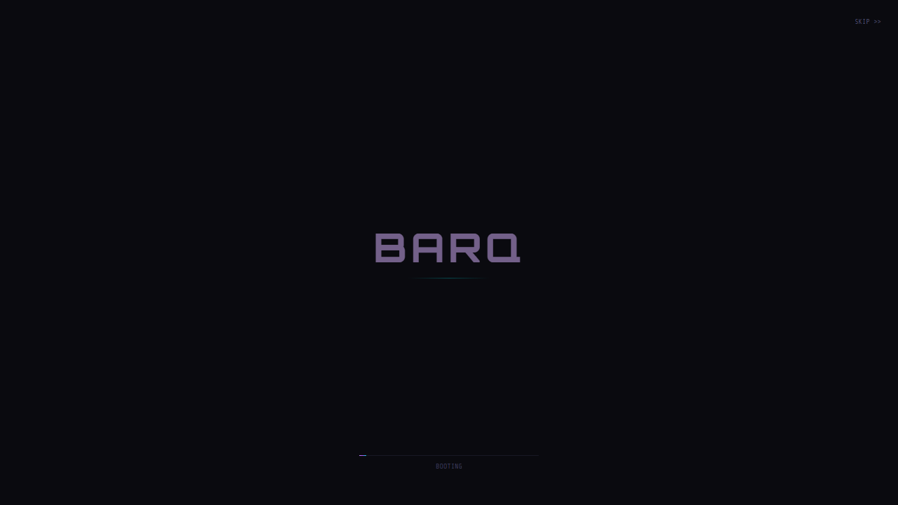

# BARQ - Voice-Controlled AI Desktop Assistant

**BARQ** is a voice-first AI desktop assistant that combines wake word detection, natural language understanding, and automation into a single, cross-platform application. Think Alexa for your computer — control apps, search jobs, create content, and more, all by voice.

Built with **Python (FastAPI)** for the backend and **Electron + React** for the desktop UI, BARQ runs on **macOS** and **Windows**.



---

## Features

### 🎤 Voice Control
- **Wake word detection** — Always-listening (Vosk), hands-free wake word activation
- **Conversation mode** — Natural back-and-forth like Alexa/Gemini; no need to say the wake word for every turn
- **VAD endpointing** — Automatically detects when you stop speaking (250ms aggressive silence)
- **Barge-in** — Interrupt BARQ mid-response by speaking over it
- **Auto-language detection** — Detects English or Hindi from speech automatically and switches TTS voice (Jenny ↔ Swara) in real-time
- **Echo-cancelling TTS** — `threading.Event()` mutex + audio buffer flush prevents feedback spiral
- **TTS error recovery** — `try/except/finally` guarantees state is always reset on audio device failure
- **Language indicators** — 🇬🇧/🇮🇳 badges in both the Navbar and mic toggle area show the current language at a glance
- **Manual language switch** — Dropdown in Settings to lock recognition to English or Hindi
- **Auto-detection status** — Settings page shows which language was last auto-detected with a live timestamp
- **Hindi Vosk model** — Wake word detection works in both English and Hindi
- **Small talk handler** — Canned responses for greetings, thanks, goodbyes — no LLM latency for common phrases
- **Configurable wake word** — Change it anytime via API

### 🧠 AI-Powered Conversation
- **Local LLM** — Runs on Ollama (llama3.1, llama3.2, phi4, or any model)
- **Cloud LLM fallback** — Transparently falls back to OpenAI-compatible APIs when Ollama is offline
- **Conversation memory** — Maintains context across multi-turn conversations
- **Streaming sentence-aware TTS** — Begins speaking while LLM continues generating (sub-second first audio)
- **Agent system** — Multi-step planner/executor with skill registry, error recovery, and replanning
- **Deep Research Agent** — Multi-round iterative research with web search, fact extraction, and report generation
- **Recruitment Agents** — Extract, match, and write ATS-optimized documents from job descriptions
- **Natural speech** — Edge TTS for high-quality text-to-speech with offline Piper TTS fallback

### 🧠 Multi-Brain Knowledge Graphs
- **Domain-specific brains** — Isolated NetworkX graphs per domain (Apple Notes, Google Docs, AI Chats, Career)
- **Persistent timeline** — Event log recording all triplet additions, survives app restarts via JSON persistence
- **Real-time timeline UI** — Right-side panel showing chronologically ordered triplet events with flash animation on new entries
- **Auto-extraction** — Scheduled extraction of knowledge triplets from new content every 3 hours
- **Tabbed visualizer** — React ForceGraph2D with distinct neon color themes per brain type
- **Semantic search** — Highlight and zoom to entities across the knowledge graph

### 📥 Gemini Chat Ingestion
- **File watcher** — Background service monitors `data/ingest/ai_chats/` and auto-ingests Gemini chat history exports
- **Dual-format parsing** — Handles both **Google Takeout JSON** and **HTML** export formats, extracting user prompts by stripping `"Said "` prefixes
- **Local LLM extraction** — Sends cleaned prompts to Ollama for triplet extraction using the knowledge graph engine
- **Watchdog mode** — Uses `watchdog` for instant file notifications (falls back to async polling when unavailable)
- **REST API** — 6 endpoints to trigger ingestion, manage the watcher, check status, and view extractor stats (`/gemini/trigger`, `/gemini/status`, etc.)
- **Resilience logging** — All failures recorded as evolution events in `memory/evolution/` for audit trail

### 💼 Job Search Automation
- **Multi-board scanning** — Searches LinkedIn, Indeed, Glassdoor, Greenhouse, Lever, Ashby, Workday, and more
- **ATS-optimized matching** — AI evaluates and scores jobs against your resume
- **Auto-apply** — Playwright-based form filling for major ATS platforms
- **Resume parsing** — Extracts structured data from Markdown resumes
- **Cover letter & cold email generation** — AI-crafted, tailored to each job

### 📱 Social Media Pipeline
- **Trend research** — Discovers trending topics across platforms
- **Script generation** — AI writes content scripts for videos
- **Video rendering** — Automated short-form video creation
- **Cross-platform posting** — Schedule and publish to multiple platforms

### 🖥️ Desktop Automation
- **Screen OCR** — Capture and extract text from any screen region
- **Smart Drop Zones** — Auto-organize files with rule-based sorting
- **AI Wallpaper** — Generate or search for wallpapers by description
- **Workflow protocols** — Create and run custom automation workflows

### 🔧 Developer Tools
- **Git operations** — Full git integration via voice
- **Package manager** — npm, pip, brew commands by voice
- **Localhost tunneling** — Expose local ports via cloudflared
- **Terminal streaming** — Real-time command output via SSE

### 🌐 Neural Dashboard UI
- **3D particle sphere** — 30,000-particle volumetric cloud with Fibonacci distribution, power-weighted density (5.0) for a packed core that thins toward the surface
- **Glowing energy core** — Additive blending + soft bokeh texture + tonemapped emissive colors create a bright, volumetric center
- **Smooth color transitions** — All visual elements (particles, rings, CSS glow) blend to new accent themes simultaneously over ~2.5s
- **Voice reactivity** — Sphere rotation, wobble, and particle pulse respond to speech in real-time
- **Mouse parallax** — Surface particles shift with cursor movement while inner particles stay static (depth-aware 3D effect)
- **CSS glow bloom** — Real-time breathing glow effect that pulses with voice activity intensity
- **Orbital rings** — Rotating rings with speed boost animation on theme switch
- **Live system metrics** — Real-time CPU, memory, disk sparkline charts polling the backend every 2s
- **Multi-city weather** — Track weather for multiple cities with live data from the backend
- **Language badge** — 🇬🇧/🇮🇳 indicator in the Navbar and mic toggle button, updating in real-time via WebSocket

---

## Quick Start

### Prerequisites

| Requirement | Version | Notes |
|---|---|---|
| Python | 3.10+ | [python.org](https://python.org) |
| Node.js | 18+ | [nodejs.org](https://nodejs.org) |
| Ollama | Latest | [ollama.ai](https://ollama.ai) — for local LLM |
| ffmpeg | Latest | Required for audio playback ([download](https://ffmpeg.org/download.html)) |
| Vosk model | ~50 MB | Auto-detected from `models/vosk/` |

### 1. Clone & Install

**macOS / Linux:**
```bash
git clone https://github.com/venom20021/B.A.R.Q-AI.git
cd barq

# Install Python dependencies
pip install -r python/requirements.txt
pip install -r python/requirements-dev.txt

# Install Node.js dependencies
npm install

# Download Vosk model (English)
cd python/models
wget https://alphacephei.com/vosk/models/vosk-model-small-en-us-0.15.zip
unzip vosk-model-small-en-us-0.15.zip
mv vosk-model-small-en-us-0.15 vosk
cd ../..
```

**Windows:**
```batch
:: Run in Command Prompt or PowerShell
git clone https://github.com/venom20021/B.A.R.Q-AI.git
cd barq

:: Install Python dependencies
pip install -r python\requirements.txt
pip install -r python\requirements-dev.txt

:: Install Node.js dependencies
npm install

:: Download Vosk model using PowerShell
cd python\models
powershell -Command "Invoke-WebRequest -Uri https://alphacephei.com/vosk/models/vosk-model-small-en-us-0.15.zip -OutFile vosk-model-small-en-us-0.15.zip"
tar -xf vosk-model-small-en-us-0.15.zip
move vosk-model-small-en-us-0.15 vosk
cd ..\..
```

### 2. Pull an Ollama model

```bash
# Recommended for speed vs quality balance
ollama pull llama3.2:3b

# Or for higher quality (slower)
ollama pull llama3.1
```

### 3. Start the services

**macOS / Linux — using the dev script:**
```bash
python scripts/dev.py
```

Or manually in two terminals:
```bash
# Terminal 1: Start the FastAPI server
cd python
python3 -m uvicorn main:app --reload --host 127.0.0.1 --port 8956

# Terminal 2: Start the desktop UI
# In the project root
npm run dev
```

**Windows — using the batch file:**
```batch
:: Double-click or run in Command Prompt
scripts\start.bat
```

Or manually in two Command Prompt windows:
```batch
:: Window 1: Start the FastAPI server
cd python
python -m uvicorn main:app --reload --host 127.0.0.1 --port 8956

:: Window 2: Start the desktop UI
npm run dev
```

### 4. Test voice control

```bash
# Check server health
curl http://127.0.0.1:8956/health

# Start voice detection
curl -X POST http://127.0.0.1:8956/voice/start

# Test text chat
curl -X POST http://127.0.0.1:8956/voice/chat/text \
  -H 'Content-Type: application/json' \
  -d '{"message":"Hello! What can you do?"}'

# Test chat with TTS audio
curl -X POST http://127.0.0.1:8956/voice/chat \
  -H 'Content-Type: application/json' \
  -d '{"message":"Tell me about yourself"}'

# Check voice status
curl http://127.0.0.1:8956/voice/status
```

---

## Architecture

```
┌─────────────────────────────────────────────┐
│              Electron Desktop UI             │
│  ┌─────────┐ ┌──────────┐ ┌──────────────┐  │
│  │  React   │ │  Tray    │ │ Wake Receiver │  │
│  │  (Vite)  │ │  Icon    │ │  (port 8112)  │  │
│  └────┬─────┘ └──────────┘ └──────┬───────┘  │
│       │ IPC                       │ HTTP      │
├───────┴───────────────────────────┴──────────┤
│          Python Sidecar (FastAPI)             │
│  ┌──────────┐ ┌────────┐ ┌───────────────┐   │
│  │  Voice   │ │  Jobs  │ │  Social Media │   │
│  │  Control │ │  Pipeline│ │  Pipeline    │   │
│  ├──────────┤ ├────────┤ ├───────────────┤   │
│  │  Desktop │ │  Web   │ │  Documents    │   │
│  │  Automation│ │  Media │ │  Generation   │   │
│  ├──────────┤ ├────────┤ ├───────────────┤   │
│  │  System  │ │ Memory │ │  Analytics    │   │
│  │  Control │ │ & Know.│ │               │   │
│  └──────────┘ └────────┘ └───────────────┘   │
│              │         │                     │
│         ┌────┘         └────┐                │
│     ┌───▼───┐          ┌───▼────┐           │
│     │ Ollama │          │ SQLite │           │
│     │ (LLM)  │          │  (DB)  │           │
│     └───────┘          └────────┘           │
└─────────────────────────────────────────────┘
```

### Key Components

| Component | Technology | Role |
|---|---|---|
| **Frontend** | Electron + React + Vite | Desktop UI, tray icon, wake receiver |
| **Backend** | Python FastAPI (uvicorn) | REST API, business logic, AI integration |
| **Voice** | Vosk (wake word) + Whisper (STT) + Edge TTS | Speech recognition & synthesis |
| **LLM** | Ollama (llama3.2:3b) | Natural language understanding & generation |
| **Database** | SQLite + aiosqlite | Persistent storage for jobs, settings, analytics |
| **Browser** | Playwright | ATS form filling, web scraping |
| **Desktop** | PyAutoGUI, MSS, PyTesseract | Screen OCR, keyboard/mouse automation |

---

## API Reference

The Python backend exposes a REST API on `http://127.0.0.1:8956`. Full OpenAPI docs at `/docs` when `BARQ_DEBUG=true`.

### Voice Endpoints

| Method | Endpoint | Description |
|---|---|---|
| POST | `/voice/start` | Start wake word detection |
| POST | `/voice/stop` | Stop wake word detection |
| POST | `/voice/chat` | Send message, get text + audio response |
| POST | `/voice/chat/text` | Send message, get text-only response |
| POST | `/voice/command` | Process a voice command |
| POST | `/voice/transcribe` | Record + transcribe microphone input |
| POST | `/voice/wake-word` | Change the wake word dynamically |
| POST | `/voice/conversation-mode` | Enable/disable hands-free conversation mode |
| POST | `/voice/conversation/start` | Start a conversation session |
| POST | `/voice/conversation/end` | End conversation |
| GET | `/voice/status` | Get voice system status |
| GET | `/voice/mic-level` | Get current microphone level |
| POST | `/voice/sensitivity` | Set detection sensitivity (low/medium/high) |
| POST | `/voice/set-tts-voice` | Change TTS voice |
| GET | `/voice/language` | Get current language setting |
| POST | `/voice/language` | Switch language (en/hi) — auto-changes TTS voice |
| GET | `/ws/status` | WebSocket for real-time voice status (mic level, language, STT text) |

### System Endpoints

| Method | Endpoint | Description |
|---|---|---|
| POST | `/system/launch-app` | Launch an application by name |
| POST | `/system/close-app` | Close an application |
| POST | `/system/terminal/run` | Execute a terminal command |
| POST | `/system/git` | Execute git operations |
| POST | `/system/package-manager` | npm/pip/brew commands |
| GET | `/system/monitors` | List connected monitors |
| POST | `/system/tunnel/expose` | Expose a local port |

### Job Endpoints

| Method | Endpoint | Description |
|---|---|---|
| POST | `/jobs/scan` | Scan job boards for listings |
| GET | `/jobs/matches` | Get matched jobs |
| POST | `/jobs/{id}/optimize` | Optimize resume for a job |
| POST | `/jobs/{id}/cover-letter` | Generate cover letter |
| POST | `/jobs/{id}/cold-mail` | Generate cold email |

### Desktop Endpoints

| Method | Endpoint | Description |
|---|---|---|
| POST | `/desktop/ocr/capture` | Capture screen region + OCR |
| POST | `/desktop/wallpaper/set` | Set wallpaper by description |
| POST | `/desktop/keyboard` | Inject keyboard input |
| POST | `/desktop/protocols/create` | Create an automation workflow |

---

## Configuration

Configuration is managed through environment variables or a `.env` file in the project root.

### Key Settings

| Variable | Default | Description |
|---|---|---|
| `SIDECAR_HOST` | `127.0.0.1` | Python backend host |
| `SIDECAR_PORT` | `8956` | Python backend port |
| `BARQ_DEBUG` | `false` | Enable debug mode + API docs |
| `VOSK_MODEL_PATH` | `models/vosk` | Path to Vosk English model |
| `OLLAMA_HOST` | `http://127.0.0.1:11434` | Ollama server URL |
| `OLLAMA_MODEL` | `llama3.2:3b` | Ollama model to use |
| `CLOUD_LLM_ENABLED` | `true` | Enable cloud LLM fallback when Ollama is offline |
| `CLOUD_LLM_MODEL` | `gpt-4o-mini` | Cloud LLM model (OpenAI-compatible) |
| `CLOUD_LLM_BASE_URL` | `https://api.openai.com/v1` | Base URL for cloud LLM API |
| `WHISPER_MODEL` | `base` | Whisper model size |
| `DATABASE_URL` | `sqlite+aiosqlite:///barq.db` | Database connection |
| `CAREER_OPS_PATH` | `~/career-ops` | Path for resume/job files |

### Cloud LLM Fallback Configuration

BARQ automatically falls back to an OpenAI-compatible cloud API when Ollama is unavailable (offline or missing model). No code changes needed — just set the environment variables once and BARQ handles the rest transparently.

#### How It Works

1. **Ollama is tried first** — Every LLM request (`chat`, `generate`, `stream_chat`) attempts Ollama locally
2. **On failure, cloud fallback kicks in** — If Ollama is unreachable, BARQ fires the same request at the configured cloud API
3. **Transparent retry** — The caller receives the response as if it came from Ollama; streaming also works
4. **One-time warning** — A log message is emitted the first time a fallback occurs so you know it happened

Supported providers: **OpenAI**, **OpenRouter**, **Groq**, **Together AI**, **Anthropic** (via API proxy), **DeepSeek**, and any service that implements the OpenAI chat completions format.

#### Step-by-Step Setup

**1. Get an API key**

| Provider | Free Tier | Sign Up | Model Suggestion |
|---|---|---|---|
| [OpenAI](https://platform.openai.com) | $5 free credits (expires) | [platform.openai.com/api-keys](https://platform.openai.com/api-keys) | `gpt-4o-mini` (cheap, fast) |
| [OpenRouter](https://openrouter.ai) | Many free models | [openrouter.ai/keys](https://openrouter.ai/keys) | `openai/gpt-4o-mini` or `meta-llama/llama-3.2-3b-instruct:free` |
| [Groq](https://groq.com) | Rate-limited free tier | [console.groq.com/keys](https://console.groq.com/keys) | `llama3-70b-8192` (very fast) |
| [Together AI](https://together.ai) | $25 free credits | [api.together.xyz/settings/api-keys](https://api.together.xyz/settings/api-keys) | `meta-llama/Llama-3.2-3B-Instruct-Turbo` |

**2. Configure `.env`**

Open (or create) `.env` in the project root and add:

```bash
# ── Required: Your API key ───────────────────────────────────
OPENAI_API_KEY=sk-proj-xxxxxxxxxxxx

# ── Optional overrides (defaults shown) ──────────────────────
CLOUD_LLM_ENABLED=true
CLOUD_LLM_MODEL=gpt-4o-mini
CLOUD_LLM_BASE_URL=https://api.openai.com/v1
```

**3. Verify it works**

```bash
# Start the backend
cd python && python -m uvicorn main:app --reload --host 127.0.0.1 --port 8956

# When the server starts, it prints a diagnostic:
#   ✅ Cloud LLM fallback ready (gpt-4o-mini at https://api.openai.com/v1)
#
# If missing:
#   ⚠ No cloud LLM fallback — set OPENAI_API_KEY in .env to enable

# Test with Ollama stopped — the fallback should respond:
curl -X POST http://127.0.0.1:8956/voice/chat/text \
  -H 'Content-Type: application/json' \
  -d '{"message":"Hello! What can you help me with?"}'
```

#### Provider-Specific Examples

<details>
<summary><strong>OpenAI</strong> (default, works out-of-the-box with an API key)</summary>

```bash
OPENAI_API_KEY=sk-proj-xxxxxxxxxxxx
CLOUD_LLM_MODEL=gpt-4o-mini
CLOUD_LLM_BASE_URL=https://api.openai.com/v1
```

Recommended models: `gpt-4o-mini` (cheapest), `gpt-4o` (best quality), `gpt-4o-mini-2024-07-18` (specific version).

</details>

<details>
<summary><strong>OpenRouter</strong> (access many models with one key)</summary>

```bash
OPENAI_API_KEY=sk-or-v1-xxxxxxxxxxxx
CLOUD_LLM_MODEL=openai/gpt-4o-mini
CLOUD_LLM_BASE_URL=https://openrouter.ai/api/v1
```

Great for trying different models without multiple accounts. Use `meta-llama/llama-3.2-3b-instruct:free` for free-tier completion.

Popular OpenRouter models: `openai/gpt-4o-mini`, `meta-llama/llama-3.2-3b-instruct:free`, `anthropic/claude-3.5-sonnet`, `google/gemini-2.0-flash-exp:free`.

</details>

<details>
<summary><strong>Groq</strong> (blazing fast inference)</summary>

```bash
OPENAI_API_KEY=gsk_xxxxxxxxxxxx
CLOUD_LLM_MODEL=llama3-70b-8192
CLOUD_LLM_BASE_URL=https://api.groq.com/openai/v1
```

Groq specializes in extremely fast inference. Free tier has rate limits (~30 req/min for 7B, ~10 req/min for 70B).

Recommended Groq models: `llama3-70b-8192`, `mixtral-8x7b-32768`, `gemma2-9b-it`.

</details>

<details>
<summary><strong>Together AI</strong> (open-source model focus)</summary>

```bash
OPENAI_API_KEY=xxxxxxxxxxxxxxxxxxxxxx
CLOUD_LLM_MODEL=meta-llama/Llama-3.2-3B-Instruct-Turbo
CLOUD_LLM_BASE_URL=https://api.together.xyz/v1
```

Together AI hosts many open-source models. The $25 free credit goes a long way for experimentation.

Recommended Together models: `meta-llama/Llama-3.2-3B-Instruct-Turbo`, `mistralai/Mixtral-8x7B-Instruct-v0.1`, `Qwen/Qwen2.5-7B-Instruct-Turbo`.

</details>

<details>
<summary><strong>DeepSeek</strong> (cheapest option)</summary>

```bash
OPENAI_API_KEY=sk-xxxxxxxxxxxx
CLOUD_LLM_MODEL=deepseek-chat
CLOUD_LLM_BASE_URL=https://api.deepseek.com/v1
```

DeepSeek's API is significantly cheaper than OpenAI for comparable quality. `deepseek-chat` is their flagship model.

</details>

<details>
<summary><strong>Anthropic Claude</strong> (via API proxy)</summary>

```bash
# Anthropic uses its own format — use OpenRouter or a proxy layer:
OPENAI_API_KEY=sk-ant-xxxxxxxxxxxx
CLOUD_LLM_MODEL=anthropic/claude-3.5-sonnet
CLOUD_LLM_BASE_URL=https://openrouter.ai/api/v1
```

Claude models require the Anthropic API format, which differs from OpenAI's. Use OpenRouter (above) as a translation layer, or any proxy that converts OpenAI-format requests to Anthropic.

</details>

#### Disabling the Fallback

If you want BARQ to fail loudly when Ollama is offline instead of falling back to the cloud:

```bash
CLOUD_LLM_ENABLED=false
```

This is useful for fully air-gapped/offline environments.

---

### Model Selection

For best performance, use these Ollama models:

| Model | Size | Speed | Quality | Command |
|---|---|---|---|---|
| `tinyllama:1.1b` | 1.1B | ⚡ Very Fast | ⭐ Basic | `ollama pull tinyllama` |
| `llama3.2:3b` | 3B | 🚀 Fast | ⭐⭐ Good | `ollama pull llama3.2:3b` |
| `phi4:2.7b` | 2.7B | 🚀 Fast | ⭐⭐⭐ Better | `ollama pull phi` |
| `llama3.1` | 8B | 🐢 Slow | ⭐⭐⭐⭐ Best | `ollama pull llama3.1` |

---

## Cross-Platform Support

BARQ is designed to run on both **macOS** and **Windows**.

### macOS (Tested)
- Vosk wake word detection ✓
- Edge TTS audio playback ✓
- Ollama LLM ✓
- Desktop automation ✓
- System tray ✓

### Windows (Supported)
- Python path detection handled automatically
- Port freeing with `taskkill` built in
- Window management via `pygetwindow`
- Wallpaper setting via `ctypes`
- App launching via `os.startfile`

### CI/CD
GitHub Actions runs linting, type-checking, building, and Python tests on every push.

---

## Development

### Project Structure

```
barq/
├── src/                    # Electron + React frontend
│   ├── main/               # Electron main process
│   │   ├── index.ts        # App entry point, wake receiver
│   │   ├── ipc.ts          # IPC handlers
│   │   ├── python-bridge.ts # Python sidecar manager
│   │   └── tray.ts         # System tray
│   ├── preload/            # Electron preload scripts
│   └── renderer/           # React UI
│       └── src/
│           ├── components/ # UI components
│           ├── pages/      # Page views
│           ├── hooks/      # Custom React hooks
│           └── styles/     # CSS/Tailwind
├── python/                 # Python backend
│   ├── main.py             # FastAPI app entry
│   ├── config.py           # Settings management
│   ├── voice/              # Voice control module
│   ├── jobs/               # Job search pipeline
│   ├── social/             # Social media pipeline
│   ├── analytics/          # Analytics aggregation
│   ├── ai/                 # LLM conversation
│   ├── system_control/     # OS-level operations
│   ├── desktop_automation/ # Screen OCR, wallpaper
│   ├── web_media/          # Web browsing, media
│   ├── documents/          # PPT, Excel, PDF generation
│   ├── notifications/      # Multi-channel notifications
│   ├── memory_knowledge/   # Multi-brain knowledge graphs, timeline event log, migration
│   ├── app/                # Application services
│   │   └── services/       #   Gemini file watcher, API routes
│   ├── database/           # SQLite DAOs
│   └── tests/              # Python test suite
├── scripts/                # Development scripts
├── .github/workflows/      # CI/CD pipeline
├── package.json            # Node dependencies
├── electron-builder.yml     # Electron packaging config
└── README.md               # This file
```

### Running Tests

```bash
# Python tests
cd python && pytest tests/ -v

# TypeScript type checks
npm run typecheck

# Frontend tests
npm run test

# Lint
npm run lint
```

---

## API Example: Full Voice Conversation

```bash
# 1. Start the voice system
curl -X POST http://127.0.0.1:8956/voice/start

# 2. Enable hands-free conversation mode
curl -X POST http://127.0.0.1:8956/voice/conversation-mode \
  -H 'Content-Type: application/json' \
  -d '{"enabled":true}'

# 3. Check system status
curl http://127.0.0.1:8956/voice/status

# 4. Change the wake word
curl -X POST http://127.0.0.1:8956/voice/wake-word \
  -H 'Content-Type: application/json' \
  -d '{"wake_word":"computer"}'

# 5. Chat with BARQ (text-only)
curl -X POST http://127.0.0.1:8956/voice/chat/text \
  -H 'Content-Type: application/json' \
  -d '{"message":"Hello! What can you help me with?"}'

# 6. Chat with BARQ (with TTS audio response)
curl -X POST http://127.0.0.1:8956/voice/chat \
  -H 'Content-Type: application/json' \
  -d '{"message":"Tell me something interesting"}'
```

---

## License

MIT License — see [LICENSE](LICENSE) for details.

---

## Acknowledgments

- [Vosk](https://alphacephei.com/vosk/) — Offline speech recognition
- [OpenAI Whisper](https://github.com/openai/whisper) — Speech-to-text
- [Edge TTS](https://github.com/rany2/edge-tts) — Text-to-speech
- [Ollama](https://ollama.ai) — Local LLM inference
- [FastAPI](https://fastapi.tiangolo.com) — Python web framework
- [Electron](https://www.electronjs.org) — Desktop app framework
